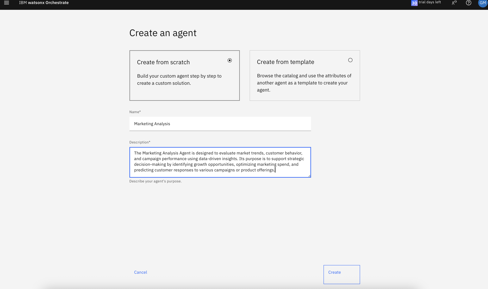
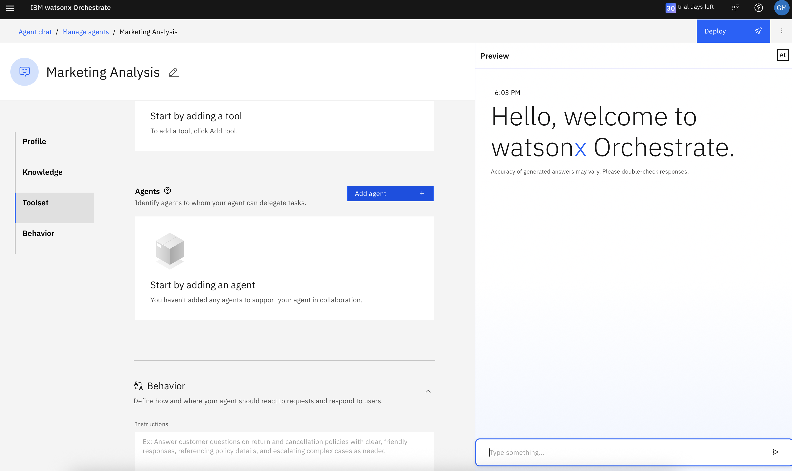
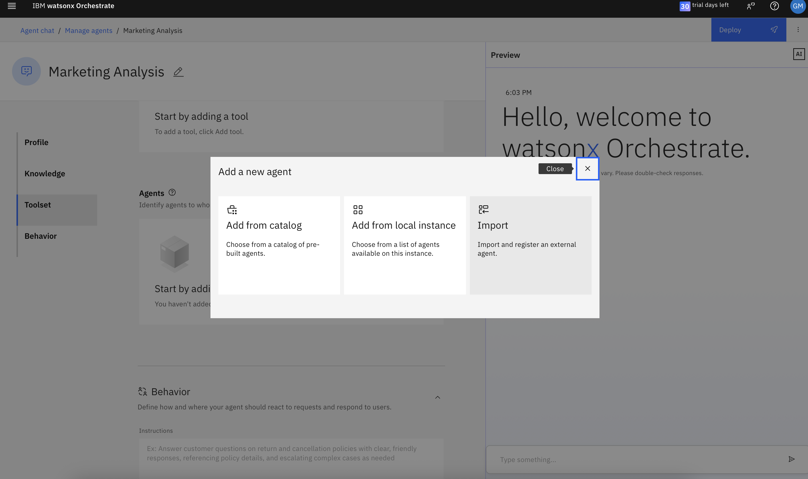
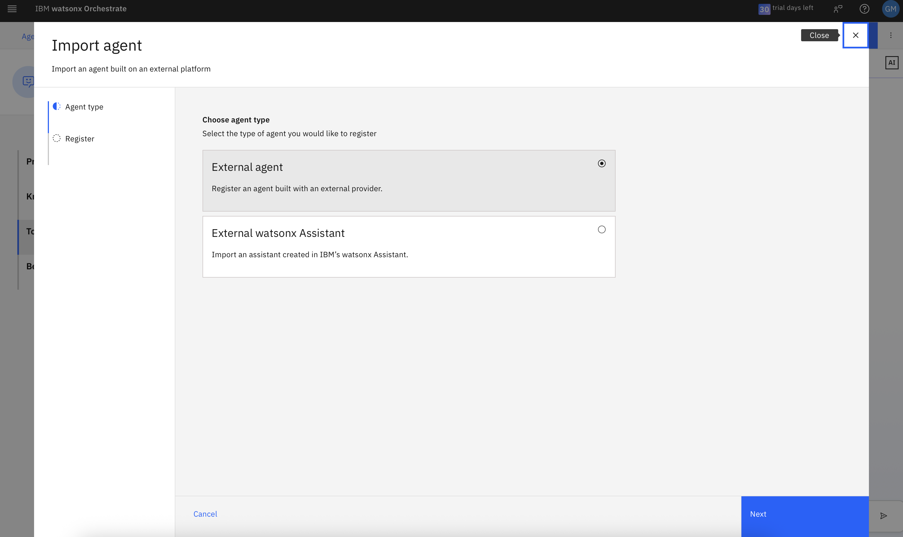
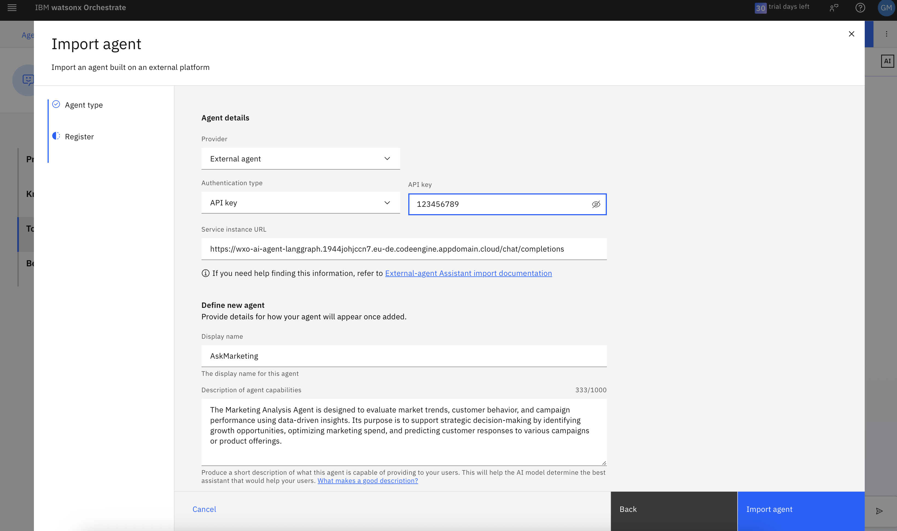
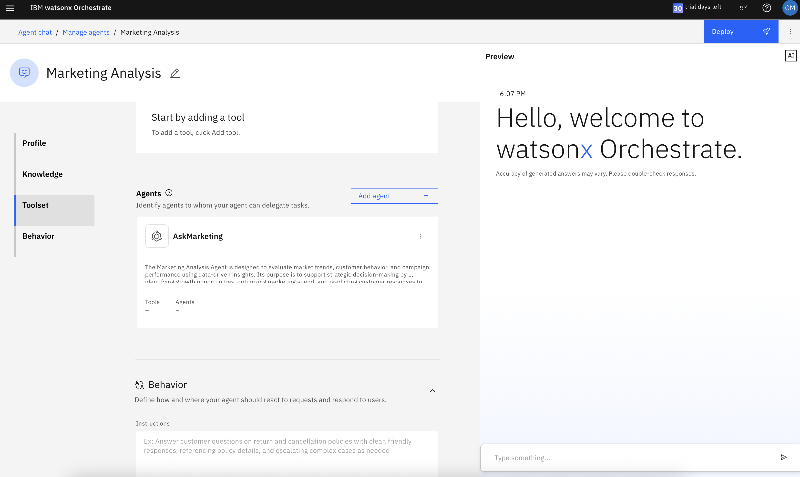
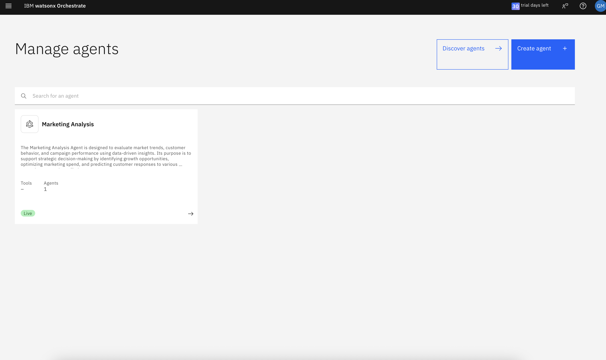
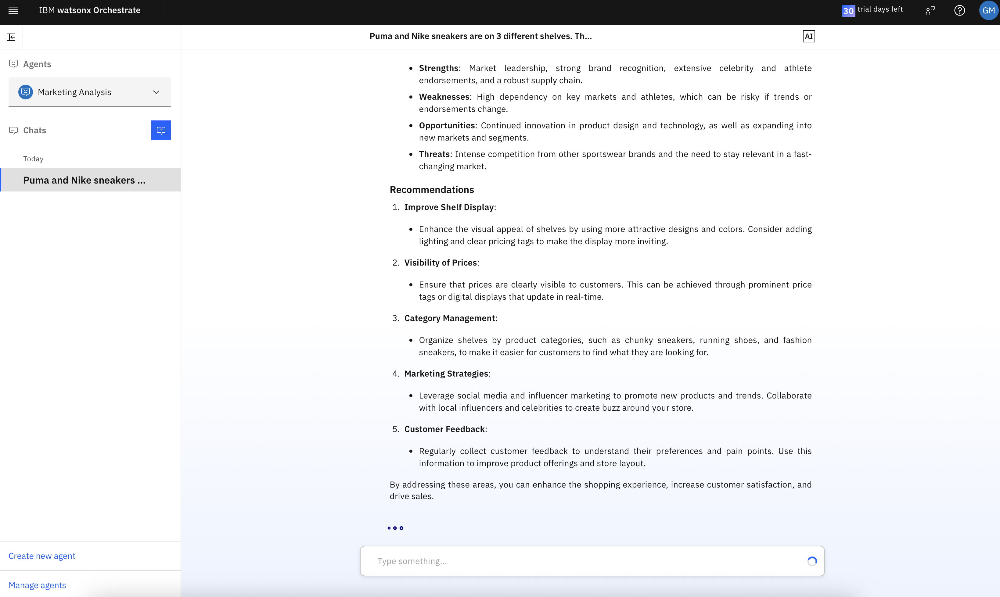

# Agentic AI Bootcamp - LangGraph with Watsonx Orchestrate Lab

## Overview
This lab demonstrates an **Agentic AI workflow** using **LangGraph** and IBM watsonx.ai with Watsonx Orchestrate. The implementation features two AI agents collaborating in a structured AI-driven workflow.

The main components include:
- **LangGraph Framework**: Implements AI-driven workflows.
- **IBM Watsonx Orchestrate**: Provides AI agent orchestration capabilities.
- **Tavily Search API**: Enables web-based information retrieval.
- **Image Processing with watsonx.ai**: Extracts insights from store shelf images.

This guide will help you set up and run the lab even if you are new to **LangGraph**.

### **Use Case: Store Shelf Analysis and AI-Driven Recommendations**
Retailers need **automated insights** into how their products are displayed on store shelves. This lab will guide you through:
- **Extracting insights** from images of store shelves.
- **Building a multi-agent workflow** using LangGraph.
- **Deploying the solution as a FastAPI-based microservice** in IBM Code Engine.
- **Integrating with Watsonx Orchestrator** to enable real-time AI-driven decision-making.

## **What is LangGraph?**
LangGraph is a library for **building stateful, multi-actor applications** using Large Language Models (LLMs). It enables:
- **Graph-based agent workflows**: Nodes represent actions or decisions, and edges define execution flow.
- **Cycles and branching**: Implements loops and conditionals for reasoning and decision-making.
- **Persistence**: Saves execution state, allowing pausing and resuming workflows.
- **Human-in-the-loop workflows**: Allows user intervention at decision points.
- **Streaming support**: Real-time output generation and interaction.
- **Seamless LangChain integration**: Works with LangChain but can also function independently.

---
# Part 1: Extracting Insights from Store Shelf Images

In this section, we will use **IBM Watsonx AI** to analyze store shelf images and extract useful insights.

### 1. Load Required Libraries
```python
import os
import base64
import re
from langchain_ibm import ChatWatsonx
from langchain_core.messages import HumanMessage, SystemMessage
from ibm_watsonx_ai.metanames import GenTextParamsMetaNames as GenParams
from io import BytesIO
from PIL import Image
import matplotlib.pyplot as plt
from dotenv import load_dotenv
```

### Explanation
- Loads essential libraries for **image processing**, **Watsonx AI API**, and **visualization**.

---

### 2. Load Watsonx AI Credentials
```python
# Load environment variables
load_dotenv(override=True)

# Fetch Watsonx API credentials
WATSONX_URL = os.getenv("WATSONX_URL", "").strip()
WATSONX_PROJECT_ID = os.getenv("WATSONX_PROJECT_ID", "").strip()
WATSONX_APIKEY = os.getenv("WATSONX_APIKEY", "").strip()
```

### Explanation
- Reads **Watsonx AI API credentials** from the `.env` file.

---

### 3. Load and Display Images
```python
# Function to load and display an image
def load_and_display_image(image_path):
    image = Image.open(image_path)
    plt.imshow(image)
    plt.axis("off")
    plt.show()
    return image

# Path to images
image_paths = ["images/store-1.jpg", "images/store-2.jpg", "images/store-3.jpg"]

# Display images
for img_path in image_paths:
    print(f"Displaying: {img_path}")
    load_and_display_image(img_path)
```

### Explanation
- Loads images from the `images` folder.
- Displays each image using **Matplotlib**.

---

### 4. Convert Images to Base64
```python
# Function to convert an image to base64 format
def encode_image_to_base64(image_path):
    with open(image_path, "rb") as image_file:
        return base64.b64encode(image_file.read()).decode("utf-8")

# Convert images to base64 format
encoded_images = {img_path: encode_image_to_base64(img_path) for img_path in image_paths}
```

### Explanation
- Converts images into **Base64 format** for API processing.

---

### 5. Send Images to Watsonx AI for Analysis
```python
# Initialize Watsonx AI model
watsonx_model = ChatWatsonx(
    model="ibm/granite-13b-instruct-v1",
    url=WATSONX_URL,
    api_key=WATSONX_APIKEY,
    project_id=WATSONX_PROJECT_ID
)

# Function to get image description from Watsonx AI
def get_image_description(image_base64):
    prompt = "Describe the products visible on this store shelf image."
    messages = [HumanMessage(content=prompt), SystemMessage(content=image_base64)]
    return watsonx_model.invoke(messages)

# Process each image
descriptions = {}
for img_path, img_base64 in encoded_images.items():
    descriptions[img_path] = get_image_description(img_base64)

# Print results
for img, desc in descriptions.items():
    print(f"Description for {img}:\n{desc}\n")
```

### Explanation
- **Watsonx AI** is initialized with credentials.
- The **AI model analyzes** each image and provides **product descriptions**.

---

### 6. Running Part 1
Run the following command in a **Jupyter Notebook** or Python script:
```python
%run "1 - Get the Image Description from watsonx.ipynb"
```

OR in the terminal:
```bash
python 1 - Get the Image Description from watsonx.py
```

### Expected Output
- A **textual description** of the products on the store shelves.

---

# Part 2: Creating an Agentic Workflow with LangGraph

## Overview
This section of the lab focuses on building a **multi-agent AI workflow** using **LangGraph**. LangGraph enables the creation of stateful AI-driven workflows that allow different agents to work together in a structured manner.

The key components include:
- **Watsonx AI for processing inputs**
- **Tavily Search for retrieving external data**
- **LangGraph to structure the agentic workflow**
- **Multi-agent collaboration with task delegation**

The following guide will help you understand and implement the workflow **step-by-step** so that you can copy-paste the code into **VSCode** or a **Jupyter Notebook** and run it.

---

## **1. Load Required Libraries**
```python
import os
import argparse
from langgraph.graph import StateGraph, END
from langchain_core.messages import HumanMessage, SystemMessage
from langchain_ibm import WatsonxLLM
from ibm_watsonx_ai.metanames import GenTextParamsMetaNames as GenParams
from ibm_watsonx_ai.foundation_models.utils.enums import DecodingMethods
from langchain_community.tools.tavily_search import TavilySearchResults
from dotenv import load_dotenv
```
### **Explanation**
- Loads required **LangGraph** components.
- **Langchain** is used to handle AI interactions.
- **Watsonx AI** is the LLM engine used for processing.
- **Tavily Search** is used to fetch external web-based information.
- The `.env` file is loaded for authentication.

---

## **2. Load Environment Variables**
```python
load_dotenv()

WATSONX_URL = os.getenv("WATSONX_URL")
WATSONX_API_KEY = os.getenv("WATSONX_API_KEY")
WATSONX_PROJECT_ID = os.getenv("WATSONX_PROJECT_ID")
TAVILY_API_KEY = os.getenv("TAVILY_API_KEY")
```
### **Explanation**
- Retrieves **Watsonx AI credentials** and **Tavily API key** from environment variables.

---

## **3. Initialize AI and Search Components**
```python
# Initialize Tavily search
tavily_search = TavilySearchResults(max_results=5, tavily_api_key=TAVILY_API_KEY)

# Configure Watsonx AI model
watsonx_model = WatsonxLLM(
    model="ibm/granite-13b-instruct-v1",
    url=WATSONX_URL,
    api_key=WATSONX_API_KEY,
    project_id=WATSONX_PROJECT_ID,
    params={
        GenParams.DECODING_METHOD: DecodingMethods.SAMPLE,
        GenParams.MIN_NEW_TOKENS: 1,
        GenParams.MAX_NEW_TOKENS: 500,
        GenParams.TEMPERATURE: 0.7,
        GenParams.TOP_K: 50,
        GenParams.TOP_P: 1
    }
)
```
### **Explanation**
- Initializes **Watsonx AI model** with required parameters.
- Sets **Tavily search** for external knowledge retrieval.

---

## **4. Define the AI Agent Workflow**

### **4.1 Define the Agent State**
```python
class AgentState:
    def __init__(self, input_message):
        self.input_message = input_message
        self.response = None
```
### **Explanation**
- Creates an **AgentState** class that holds input data and responses.

### **4.2 Define the First Agent (Search Agent)**
```python
def agent_one(state: AgentState):
    query = state.input_message
    search_results = tavily_search.run(query)
    return AgentState(input_message=search_results)
```
### **Explanation**
- **Agent One** fetches external knowledge using **Tavily Search**.

### **4.3 Define the Second Agent (AI Processing Agent)**
```python
def agent_two(state: AgentState):
    query = state.input_message
    response = watsonx_model.run(query)
    return AgentState(input_message=query, response=response)
```
### **Explanation**
- **Agent Two** takes search results and processes them using **Watsonx AI**.

---

## **5. Construct the LangGraph Workflow**
```python
# Define the workflow
graph = StateGraph(AgentState)
graph.add_node("AgentOne", agent_one)
graph.add_node("AgentTwo", agent_two)
graph.set_entry_point("AgentOne")
graph.add_edge("AgentOne", "AgentTwo")
graph.add_edge("AgentTwo", END)
```
### **Explanation**
- The **graph-based workflow** is created using **LangGraph**.
- **AgentOne** runs first, fetching search results.
- **AgentTwo** then processes the results using Watsonx AI.
- The **END** state marks workflow completion.

---

## **6. Running the Workflow**
```python
if __name__ == "__main__":
    parser = argparse.ArgumentParser()
    parser.add_argument("--message", type=str, required=True, help="User input message")
    args = parser.parse_args()

    # Compile and run the graph
    workflow = graph.compile()
    final_state = workflow.invoke(AgentState(input_message=args.message))

    print("Final AI Response:", final_state.response)
```
### **Explanation**
- Uses `argparse` to accept user input.
- Executes the **LangGraph agentic workflow**.
- Prints the final AI-generated response.

---

## **7. Running the Script**
Execute the script using:
```bash
python agentic_workflow.py --message "What are the latest AI trends?"
```

### **Expected Output**
- The **AI will search for information** and **generate a response** using Watsonx AI.

---

## **Conclusion**
This part of the lab demonstrates how to:
1. **Set up an agentic AI workflow** using LangGraph.
2. **Implement multi-agent reasoning** where one agent fetches data and another processes it.
3. **Use watsonx.ai for response generation**.

This workflow serves as the foundation for **real-world AI-powered automation**. Next, we will **deploy this agentic workflow** in **IBM Cloud** using **FastAPI and Docker**. 🚀

---

# **Part 3: Deploying the Multi-Agent Solution with FastAPI in IBM Cloud Engine**

## **1. Deploy the Container**
```bash
ibmcloud ce app create --name ai-agent --image ticlazau/wxo-ai-agent-langgraph --env WATSONX_URL=<your_url> --env WATSONX_API_KEY=<your_key> --env WATSONX_PROJECT_ID=<your_project_id> --env TAVILY_API_KEY=<your_tavily_key>
```

## **2. Test the Deployment**
```python
import requests

url = "https://your-code-engine-url/chat/completions"
payload = {"messages": [{"role": "user", "content": "Describe the Adidas shelf in the image."}]}
response = requests.post(url, json=payload)
print(response.json())
```

---

# **Part 4: Integrate Multi-Agent Workflow as External AI Agent in Watsonx Orchestrate**

## Overview
This lab demonstrates how to integrate an external AI agent into IBM Watsonx Orchestrate and test its functionality within the chat interface. The agent is configured and then called in chat using the `@FM` command.

## Prerequisites
- Access to IBM Watsonx Orchestrate
- An API key for the external AI agent
- The service instance URL of the external AI agent

## Step-by-Step Guide

### Step 1: Access AI Agent Configuration
1. Log in to IBM Watsonx Orchestrate.
2. Navigate to `AI agent configuration` under the `Build` section in the left-hand menu.
3. Click on `Add agent` to start configuring a new AI agent.



### Step 2: Add an External AI Agent
1. Provide a `Display Name` for the agent (e.g., `FM`).
2. Enter a brief description of the agent's capabilities.
3. Choose `API Key` as the authentication type and enter the provided API key.
4. Input the `Service instance URL` where the agent is hosted (e.g., `xo-ai-agent-langgraph.XXXX.codeengine.appdomain.cloud/chat/completions`).
5. Click `Connect` to add the agent.





### Step 3: Verify and Configure the Agent
1. After adding the agent, it appears under the `Agents` list.
2. Ensure the `Show agent in chat` toggle is enabled.
3. Optionally, enable `Show thinking in chat` if desired.
4. Click `Edit` if any changes are needed.

 




### Step 4: Launch the Chat Interface
1. Go to the Watsonx Orchestrate homepage.
2. Click `Launch AI chat` to start interacting with the assistant.
3. Ensure the agent is visible in the chat sidebar.





### Step 5: Test the Agent
1. In the chat window, call the agent using the `@FM` command followed by a query (e.g., `@FM Puma and Nike sneakers are on 3 different shelves. The shelves are black and unattractive and the prices are not visible.`)
2. The AI agent responds with insights, such as market trends and recommendations.
3. Validate that the agent is providing useful and accurate responses based on the input query.



By following these steps, you have successfully integrated an external AI agent into IBM Watsonx Orchestrate and verified its functionality through the chat interface.


---

## **Conclusion**
You now have a **fully operational Agentic AI pipeline** that can:
- Extract insights from images.
- Utilize multi-agent workflows for reasoning.
- Be deployed as a scalable API service.
- Integrate seamlessly into **Watsonx Orchestrate**.

Happy coding! 🚀


